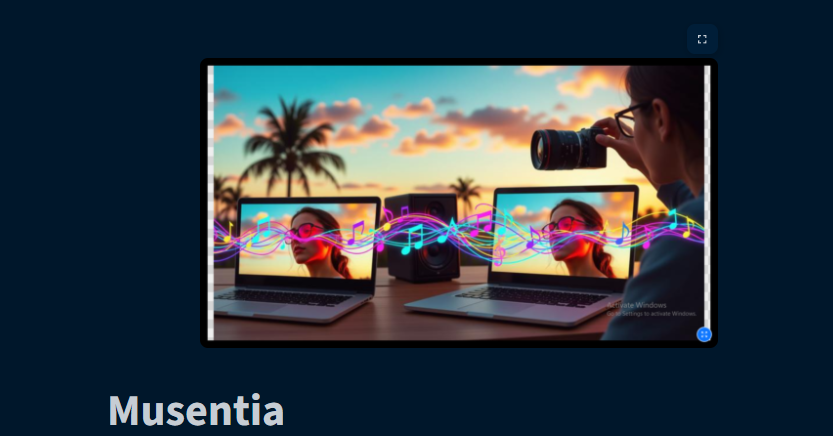
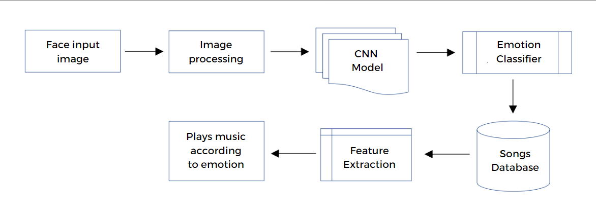

# Musentia - Facial emotion detection based music recommendation system

### Table of Contents
1. [About the Project](#about)
2. [Useful Links](#useful-links)
3. [Features](#features)
4. [Dependencies](#dependencies)
5. [Instructions](#instructions)
6. [System Architecture](#system-architechture)
7. [Structure of this repository](#repository-structure)
8. [Future Scope](#future-scope)
9. [References](#references)

### About
This repository demonstrates an end-to-end pipeline for real-time Facial emotion recognition application along with reccommending music based on detected emotions.
Done in three steps:
1. Face Detection: from the video source using OpenCV.
2. Emotion Recognition: using a model trained by using Mediapipe library.
3. Music Recommendation: Using detected emotion to create a search query on Youtube

The model is trained for 50 epochs and runs at 87% accuracy.

### Features
1. Landing Page

2. Detection of various emotions like [Sad, Angry, Happy, Neutral, Surprise]
 
3. Detection of various gestures like [Hello, Thumbsup, Nope, Rock]

### Dependencies
This project depends on Python and following packages which can be easily installed through `requirements.txt` file by running the following command:
`pip install -r requirements.txt`
opencv-python==4.7.0.72
streamlit==1.25.0
streamlit-webrtc==0.45.0
mediapipe==0.10.14
av==10.0.0
keras==2.9.0
tensorflow==2.9.0
numpy==1.23.5
dlib==19.24.4
 
### Instructions
#### Testing Locally
-	`git clone `
-	Run `pip install -r requirements.txt` to install all dependencies.
-	`cd ./moosic`
-	`streamlit run app.py`
-	The app is now running at http://localhost:8501
-	While testing, wait for the model to detect your emotions and click on recommend button to get songs based on a particular emotion
- Emotion used previously are stored as cache and might cause an error in recommending music, delete `detected_emotion.npy file` in the directory to resolve this. 
- Recommended music is loaded in next tab as a youtube search query.

### System Architecture

### Future Scope
- Addition of more gestures, and control of volume using gesture detection.

### References
- [Emotional Detection and Music Recommendation System
based on User Facial Expression - S Metilda Florence and M Uma](https://iopscience.iop.org/article/10.1088/1757-899X/912/6/062007/pdf)

